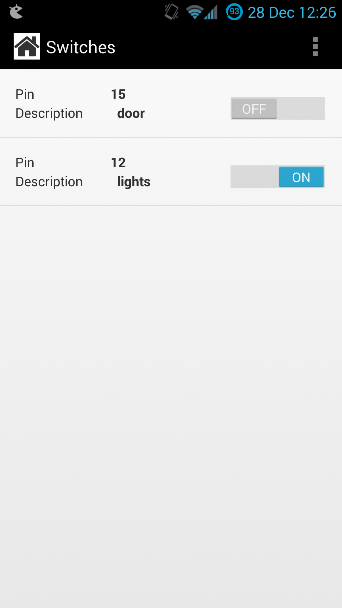

Heimdroid
=========

http://jorism.github.io/Heimdroid

Android app for heimcontrol.js

On your heimcontrol Server, check out this branch: `https://github.com/JorisM/heimcontrol.js/tree/feature/api`

Download and install app, point your settings url to your Heimcontroljs Server and you are good to go.

Note: I had to enable port 8080 or whatever on my local firewall, otherwise requests didn't go through. If you have your Server listening on port 80, you can
don't need to specifiy the port. (i.e `http://heimcontrol:80/` --> `http://heimcontrol/`)

Known bugs, will be fixed soon:
- If you change your url in settings, you need to manually kill the app and restart it, otherwise it won't change the url
- Changes from Server are not pushed to android device yet.
